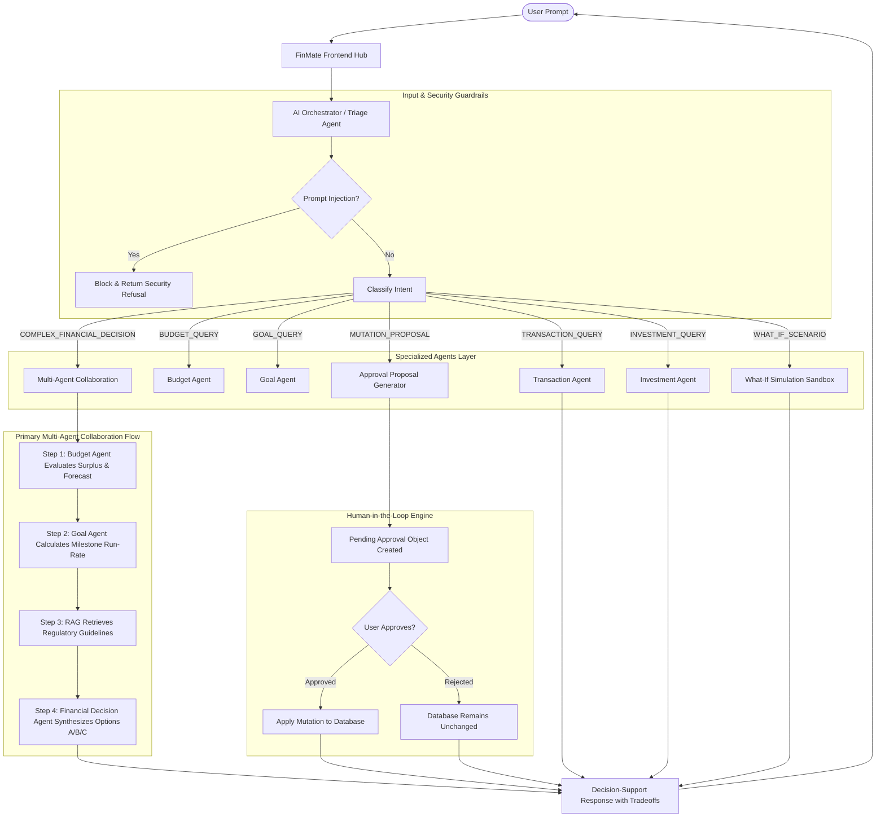

# AI Orchestration & Multi-Agent Workflows

## 1. Orchestration Architecture Diagram

---

## 2. Intent Routing Rules
1. **Simple Queries** route directly to the single specialist:
   - *"How much did I spend on food?"* → `TransactionAgent`
   - *"Can I save ₹10,000 this month?"* → `BudgetAgent`
   - *"Can I reach my education goal?"* → `GoalAgent`
   - *"What does an ETF mean?"* → `InvestmentAgent`
   *(Prevents multi-agent latency, cost, and complexity overhead when unnecessary.)*
2. **Multi-Domain Complex Queries** trigger sequential multi-agent collaboration:
   - *"Can I afford a ₹20,000 laptop next month without hurting my education goal?"*
     → `AIOrchestrator` → `BudgetAgent` → `GoalAgent` → `FinancialDecisionAgent`
   - *"I am spending more than usual. What should I look at first?"*
     → `AIOrchestrator` → `TransactionAgent` → `BudgetAgent` → `FinancialDecisionAgent`

---

## 3. Execution Bounds & Loop Detection
To protect system resources and prevent infinite loops:
- `MAX_AGENT_STEPS = 8`
- `MAX_TOOL_CALLS = 12`
- `MAX_AGENT_HANDOFFS = 3`
- **Cycle Detection**: The orchestrator records a set of `(agent, action)` signatures. If a cycle is detected (e.g. Agent A → Agent B → Agent A), execution immediately breaks and returns the accumulated partial results safely.
