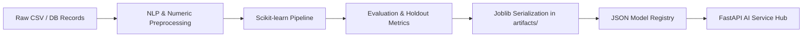

# FinMate Phase 3 — Machine Learning Pipeline Architecture

---

## 1. Pipeline Overview

The FinMate ML pipeline provides modular, reproducible, and auditable pipelines for model training, evaluation, and inference.



---

## 2. Core Components

### 2.1 Preprocessing & Leakage Prevention
- Scikit-learn custom transformer `TextNormalizer` encapsulates text sanitization directly inside `Pipeline` objects.
- Normalization strips currency symbols (`₹`, `INR`, `Rs.`), normalizes payment system tokens (`UPI/xxx`, `POS`), and standardizes alphanumeric casing.
- Time-series features are strictly derived from lagged records ($t-1, t-2, t-3$).

### 2.2 Model Artifact Storage
- Serialized artifacts are stored under `backend/app/ai/artifacts/`:
  - `classifier_champion.joblib` (Calibrated LinearSVC Pipeline)
  - `classifier_logistic_regression.joblib`
  - `classifier_calibrated_svc.joblib`
  - `forecaster_champion.joblib` (Ridge Regression model)
  - `forecaster_ridge.joblib`
  - `forecaster_rf.joblib`
  - `anomaly_detector.joblib` (Isolation Forest estimator)

### 2.3 Lightweight Model Registry
Metadata is recorded in `backend/app/ai/registry/model_registry.json`:
- `task`: Task identifier (`transaction_classification`, `expense_forecasting`, `anomaly_detection`)
- `model_name`: Descriptive algorithm name
- `version`: Semantic model version string (`v1.0`)
- `hyperparameters`: Hyperparameter configurations
- `metrics`: Real measured evaluation metrics (Accuracy, F1, MAE, RMSE, R²)
- `is_selected`: Champion status indicator
- `is_baseline`: Benchmark indicator
- `registered_at`: ISO 8601 UTC timestamp

---

## 3. Training Commands

Execute the master training suite from repository root or backend directory:
```bash
# In backend/
uv run python -m app.ai.training.train_all
```
Or execute individual training modules:
```bash
uv run python -m app.ai.training.train_classifier
uv run python -m app.ai.training.train_forecaster
uv run python -m app.ai.training.train_anomaly
uv run python -m app.ai.rag.evaluate
```
