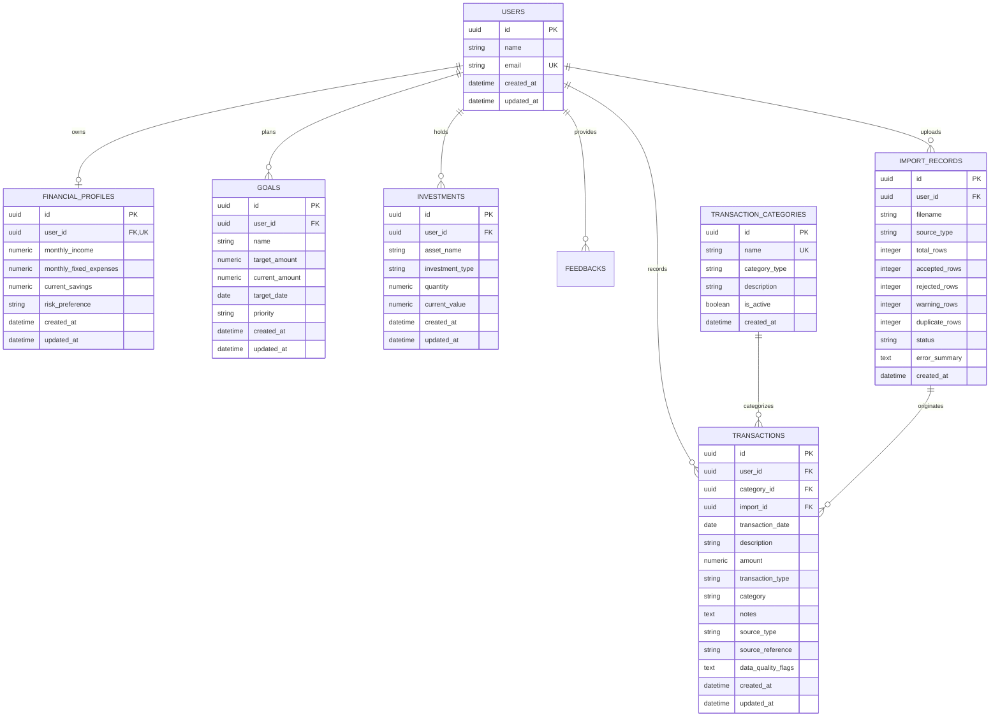

# FinMate Database Architecture & Entity-Relationship Model

## ER Diagram (Phase 2)

## Critical Constraints
- `amount > 0`: Enforced by database check constraint `ck_transactions_amount_positive`.
- Primary keys: UUIDs throughout all entities.
- Monies: `NUMERIC(15, 2)` (no floating point imprecision).
- Lineage: Foreign key links from `transactions.import_id` to `import_records.id`.
